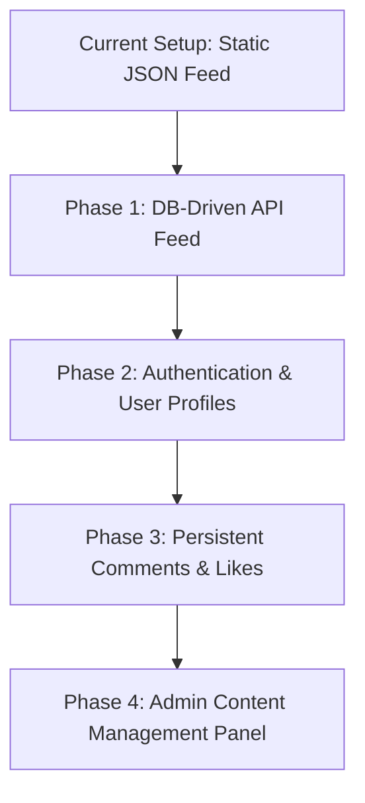

# Playonix Project Suggestions & Roadmap

This file contains technical proposals to connect the Playonix client application with the NestJS API server. 

---

## Roadmap Overview



---

## 1. Database-Driven Media Feed (Infinite Scroll)
Replace the static `mediaData.json` file in the public folder with live media records from the NestJS database.

### Implementation Checklist
- [ ] **Backend**: Expose `GET /api/v1/media` with support for page and limit queries:
  ```typescript
  // Example controller interface
  @Get()
  async findAll(@Query() query: { page: number; limit: number; tag?: string })
  ```
- [ ] **Frontend**: Define a `getMediaFeed` query in `mediaApi.ts` using RTK Query.
- [ ] **Frontend**: Implement an `IntersectionObserver` in `MediaFeed.tsx` to fetch subsequent pages as the user scrolls.

---

## 2. Authentication & User Profiles
Synchronize user state with JWT tokens to secure actions like liking, commenting, and rating.

### Implementation Checklist
- [ ] **Frontend**: Add Login and Registration forms (modal or page) validating inputs via Zod.
- [ ] **Frontend**: Store tokens securely using `js-cookie` and hook into the existing API base query logic.
- [ ] **Frontend**: Create a user profile view showing active settings, avatar preferences, and history of claimed offers.

---

## 3. Persistent Comments & Replies
Store user reviews and discussion threads in the database instead of local storage.

### Prisma Model Proposal
```prisma
model Comment {
  id        Int      @id @default(autoincrement())
  mediaId   Int
  userId    String?
  username  String
  avatar    String?
  text      String
  likes     Int      @default(0)
  createdAt DateTime @default(now())
  
  media     media    @relation(fields: [mediaId], references: [id], onDelete: Cascade)
}
```

### Implementation Checklist
- [ ] **Backend**: Generate a Comment module (`nest g module comment`).
- [ ] **Backend**: Expose `POST /api/v1/comments` and `GET /api/v1/comments/media/:mediaId`.
- [ ] **Frontend**: Inject comment endpoints into RTK Query and remove localStorage map fallbacks.

---

## 4. Persistent Favorites and Likes
Allow users to persist bookmarked items and liked gaming clips across different devices.

### Implementation Checklist
- [ ] **Prisma Schema**: Define a join table model tracking `userId` and `mediaId` pairs.
- [ ] **Backend**: Expose `/api/v1/favorites` endpoints allowing `POST` (toggle) and `GET` (fetch list).
- [ ] **Frontend**: Bind the bookmark icon to the live backend state.

---

## 5. Admin Upload Dashboard
An admin panel to register, edit, and upload new media cards/slot clips.

### Implementation Checklist
- [ ] **Backend**: Use a `@Roles('ADMIN')` guard on media write routes.
- [ ] **Frontend**: Design a dashboard layout for admins to fill in title, redirection links, tags, and upload video or image assets directly.
